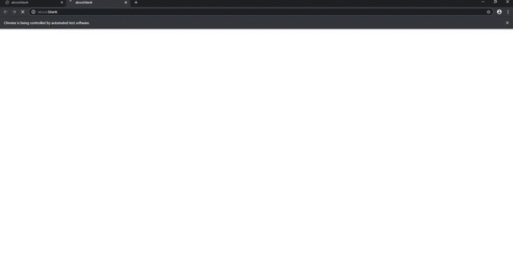
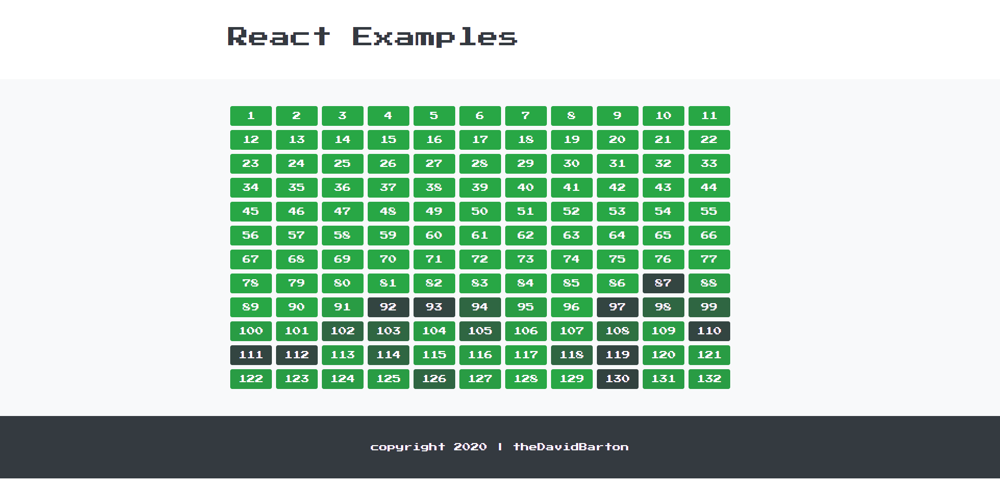
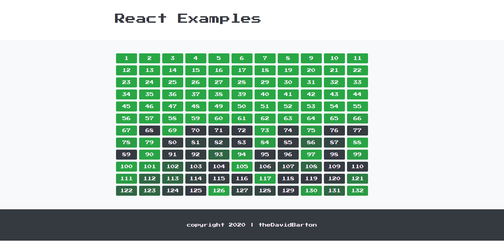
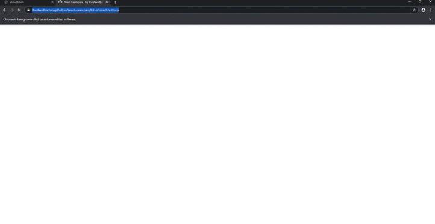
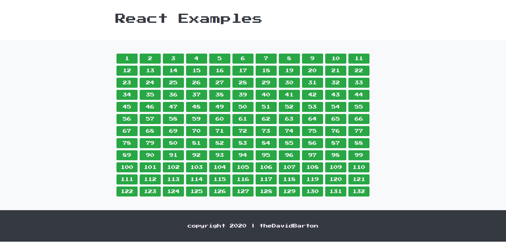
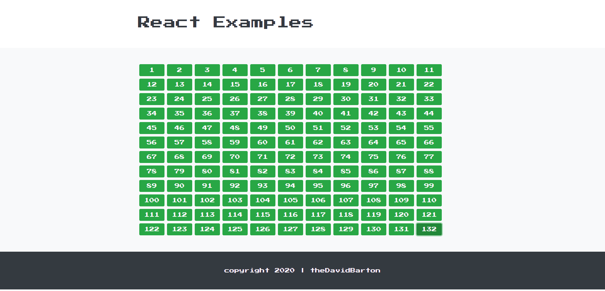

# Iterating puppeteer async methods in `for` loop vs. `Array.map()/Array.forEach()`

As all puppeteer methods are asynchronous it doesn't matter how we iterate over them. I've made a comparison and a rating of the most commonly recommended and most commonly used options.

For this purpose I have created a React.Js example page with a lot of React buttons [here](https://thedavidbarton.github.io/react-examples/#/lot-of-react-buttons) (I just call it _Lot Of React Buttons_). Here **(1)** we are able set how many buttons to be rendered on the page; **(2)** we can activate the black buttons to green by clicking on them. I consider it an identical usecase as the OP's, and it is also a general case of browser automation (we expect something to happen if we've done something on the page). 
Let's say our use case is:

```gherkin
Scenario outline: click all the buttons with the same selector
  Given I have <no.> black buttons on the page
  When I click on all of them
  Then I should have <no.> green buttons on the page

  Examples:
    | no.  |
    | 132  |
    | 1320 |
```

There is a conservative and a rather extreme scenario. To click **132** buttons is not a huge CPU task, **1320** can take a bit of time.

## ❌ Array.map

In general if we only want to perform async methods like [`elementHandle.click`](https://pptr.dev/#?product=Puppeteer&version=v4.0.1&show=api-elementhandleclickoptions) in iteration, but we don't want to return a new array it is bad practice to use `Array.map`. Other than that you will see from the test results it behaves differently tan we'd expect it to do as it generates all the requests all the same time and does not await each async functions.

### Code example

```javascript
  const elHandleArray = await page.$$('button')
  // Array.map
  elHandleArray.map(async el => {
    await el.click()
  })

  await page.screenshot({ path: 'clicks_map.png' })
  await browser.close()
```

### Specialities

- returns another array
- parallel execution inside the .map method
- fast

### 132 button scenario result:

By watching the browser in headful mode it looks like it works, but if we check when the `page.screenshot` happened: we can see the clicks were still in progress. It is due to the fact the `Array.map` cannot be awaited by default. It is only luck that the script had enought time to resolve all clicks on all elements until the browser was not closed.



### 1320 button scenario result:

If we increase the number of elements with the same selector we will run into the following error:
`UnhandledPromiseRejectionWarning: Error: Node is either not visible or not an HTMLElement`, because we already reached `await page.screenshot()` and `await browser.close()`: the loop is still running but the page is already closed.

---

## ❌ Array.forEach

Almost the same case as with `Array.map` method, except: for `Array.forEach` does not return a new array.

### Code example

```javascript
  const elHandleArray = await page.$$('button')
  // Array.forEach
  elHandleArray.forEach(async el => {
    await element.click()
  })

  await page.screenshot({ path: 'clicks_foreach.png' })
  await browser.close()
```

### Specialities

- parallel execution inside the .forEach method
- fast

### 132 button scenario result:

By watching the browser in headful mode it looks like it works, but if we check when the `page.screenshot` happened: we can see the clicks were still in progress.



### 1320 button scenario result:

If we increase the number of elements with the same selector we will run into the following error:
`UnhandledPromiseRejectionWarning: Error: Node is either not visible or not an HTMLElement`, because we already reached `await page.screenshot()` and `await browser.close()`: the loop is still running but the page is already closed.

---
## ✔ page.$$eval + forEach

The best performing solution is a slightly modified version of _bside_'s [answer](https://stackoverflow.com/a/54712599/12412595).

### Code example

```javascript
  // page.$$eval + Array.forEach
  await page.$$eval('button', elHandles => elHandles.forEach(el => el.click()))

  await page.screenshot({ path: 'clicks_eval_foreach.png' })
  await browser.close()
```
### Specialities

- parallel execution inside the .forEach method
- extremely fast

### 132 button scenario result:

By watching the browser in headful mode we see the effect is immediate, also the screenshot is snapped after every element has been clicked.



### 1320 button scenario result:

Works just like in case of 132 buttons.

---
## ✔ for...of loop

The simpliest option, not that fast, but executes clicks in sequence. The script won't go to `page.screenshot` until the loop is not finished.

### Code example

```javascript
  const elHandleArray = await page.$$('button')
  // for...of
  for (const el of elHandleArray) {
    await el.click()
  }

  await page.screenshot({ path: 'clicks_for_of.png' })
  await browser.close()
```
### Specialities

- execution in sequence inside the for...of loop
- slow

### 132 button scenario result:

By watching the browser in headful mode we see the events are happening in strict order, also the screenshot is snapped after every element has been clicked.



### 1320 button scenario result:

Works just like in case of 132 buttons (but takes more time).

---

# Summary

- Avoid using `Array.map` if you only want to perform async events in iteration that don't return anything.
- `Array.forEach` is an option, but you need to wrap it so the next async method only starts after all promises are resolved.
- Combine `Array.forEach` with `$$eval` for best performance if the order of async events doesn't maeetr inside the iteration.
- Use `for`/`for...of` if speed is not a must and if the order of the async events does matter inside the iteration.
